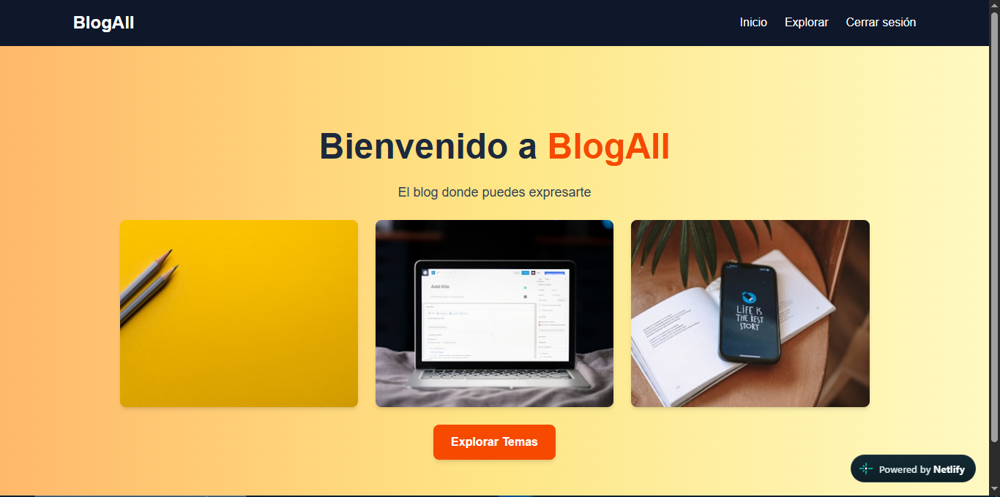
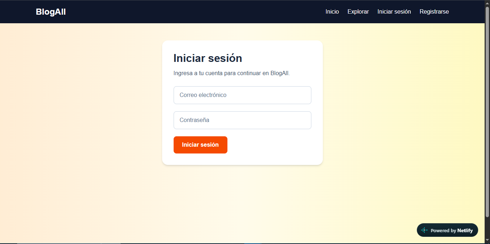
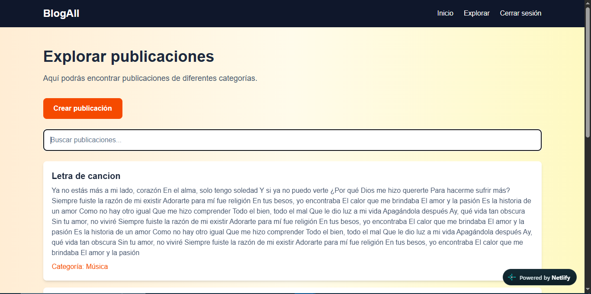
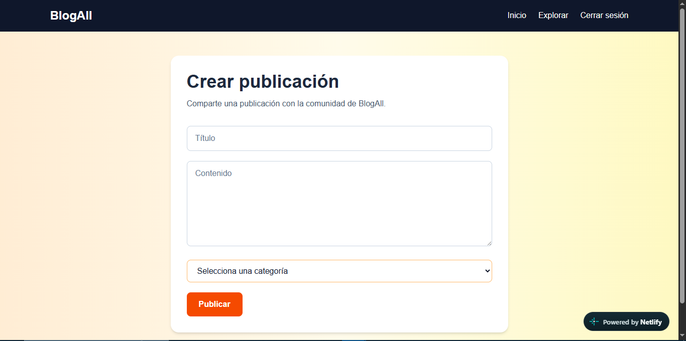
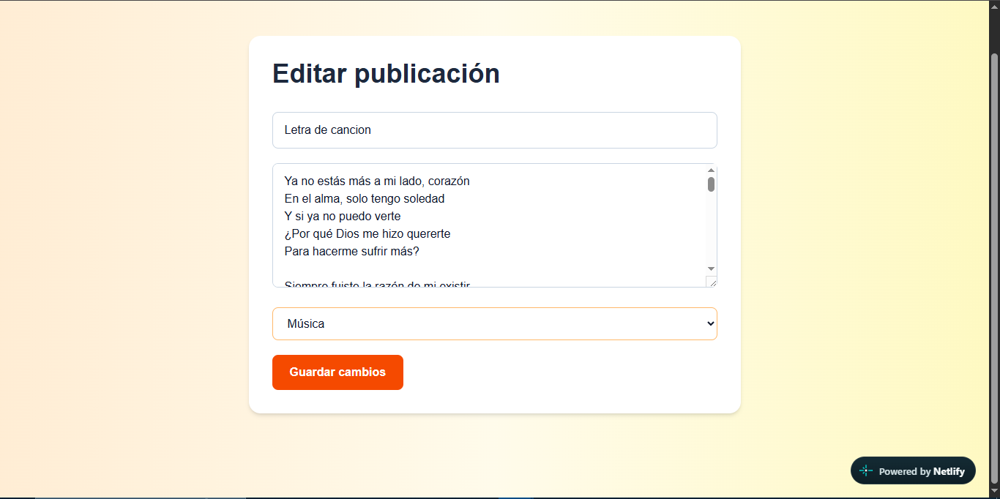

# BlogAll

BlogAll ofrece un espacio para compartir publicaciones y expresar ideas sin la presión de agradar a otros o seguir las tendencias, como lo es la interacción en las redes sociales actuales.

## Demo

**URL pública:** https://blogallsite.netlify.app/ 

## Capturas de pantalla

### Página principal



### Inicio de sesión



### Explorar publicaciones



### Crear publicación



### Editar publicación



## Tecnologías utilizadas

* Next.js 14
* TypeScript
* Tailwind CSS
* Supabase
* PostgreSQL
* Netlify
* Unsplash API

## Funcionalidades

* Registro de usuarios.
* Inicio y cierre de sesión.
* Autenticación mediante Supabase.
* Roles de usuario.
* Exploración de publicaciones.
* Creación de publicaciones.
* Edición de publicaciones propias.
* Eliminación de publicaciones propias.
* Categorías para las publicaciones.
* Protección de rutas privadas mediante middleware.
* Ruta dinámica para trabajar con publicaciones específicas.
* Consumo de una API externa mediante `fetch` y `async/await`.
* Manejo básico de errores al consumir la API de Unsplash.
* Diseño responsive utilizando Tailwind CSS.

## Roles

### Lector

El usuario registrado como lector puede:

* Iniciar sesión.
* Explorar publicaciones.
* Consultar el contenido disponible.

### Autor

El autor tiene las funcionalidades del lector y además puede:

* Crear publicaciones.
* Editar sus propias publicaciones.
* Eliminar sus propias publicaciones.

Cada autor puede modificar únicamente las publicaciones que le pertenecen.

## Rutas principales

### Rutas públicas

* `/` — Página principal de BlogAll.
* `/login` — Inicio de sesión.
* `/register` — Registro de usuarios.

### Rutas privadas

* `/explorar` — Exploración de publicaciones.
* `/crear` — Creación de publicaciones.

Estas rutas están protegidas mediante `middleware.ts`. Si un usuario no tiene una sesión activa, es redirigido a `/login`.

### Ruta dinámica

* `/editar/[id]` — Permite editar una publicación específica utilizando su identificador.

## Modelo de datos

La aplicación utiliza Supabase como base de datos PostgreSQL.

Entre las tablas utilizadas se encuentran:

* `profiles` — Información relacionada con los usuarios y sus roles.
* `categorias` — Categorías disponibles para las publicaciones.
* `publicaciones` — Contenido publicado por los usuarios.

Las publicaciones se relacionan con una categoría y con el usuario que las creó. 

Su estructura completa es:

### Tabla `profiles`

Almacena la información de los usuarios registrados y su rol dentro de la aplicación.

- `id` — Identificador del usuario.
- `rol` — Rol del usuario, como `lector` o `autor`.

### Tabla `categorias`

Almacena las categorías disponibles para clasificar las publicaciones.

- `id` — Identificador de la categoría.
- `nombre` — Nombre de la categoría.

### Tabla `publicaciones`

Almacena las publicaciones creadas por los usuarios.

- `id` — Identificador de la publicación.
- `titulo` — Título de la publicación.
- `contenido` — Contenido de la publicación.
- `categoria_id` — Categoría a la que pertenece.
- `autor_id` — Usuario que creó la publicación.

### Relaciones

- Un usuario de `profiles` puede crear varias publicaciones en `publicaciones`.
- Una categoría de `categorias` puede tener varias publicaciones.
- Cada publicación pertenece a una sola categoría.
- Cada publicación tiene un solo autor.

La relación principal puede representarse de la siguiente manera:

profiles (1) ──── (N) publicaciones (N) ──── (1) categorias

## Autenticación

La autenticación se realiza mediante Supabase Auth.

Los usuarios pueden registrarse e iniciar sesión utilizando su correo electrónico y contraseña.

Las rutas privadas utilizan un middleware para comprobar que exista una sesión activa antes de permitir el acceso.

## API externa — Unsplash

BlogAll consume la API REST de Unsplash para obtener imágenes relacionadas con la temática del blog.

El consumo se realiza en:

`components/UnsplashImages.tsx`

La información se obtiene utilizando `fetch` y `async/await`.

Las imágenes recibidas se renderizan dinámicamente mediante los datos obtenidos de la API.

También existe un manejo básico de errores para mostrar un mensaje cuando las imágenes no pueden ser obtenidas.

La clave de acceso de Unsplash se almacena mediante una variable de entorno y no forma parte del código público del repositorio.


## Variables de entorno

Para ejecutar el proyecto localmente se deben configurar las variables de entorno en `.env.local`.

```text
UNSPLASH_ACCESS_KEY=clave_de_unsplash
NEXT_PUBLIC_SUPABASE_URL=url_de_supabase
NEXT_PUBLIC_SUPABASE_PUBLISHABLE_KEY=clave_de_supabase
```

Las claves reales son privadas por lo que no deben publicarse en GitHub ni dentro del README.

## Instalación

Clonar el repositorio:

git clone URL_DEL_REPOSITORIO

Entrar en la carpeta:

cd blogall

Instalar las dependencias:

npm install

Configurar el archivo .env.local con las variables necesarias.

Ejecutar el proyecto:

npm run dev

La aplicación estará disponible localmente en:

http://localhost:3000

## Despliegue

El proyecto fue desplegado utilizando Netlify y conectado al repositorio de GitHub.

Cada vez que se realiza un nuevo `push` al repositorio, Netlify puede generar automáticamente un nuevo despliegue.

## Credenciales de prueba

- Rol Lector: wonor88848@ebflyai.com / 123contraseña
- Rol Autor: pakohiv698@bocably.com / 123contraseña

(El usuario de autor tiene una publicacion creada para mejor apreciación de permisos)

## Autor

Proyecto académico desarrollado por Axel Sánchez
